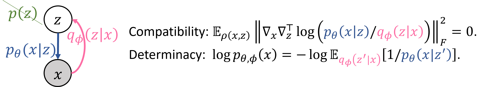
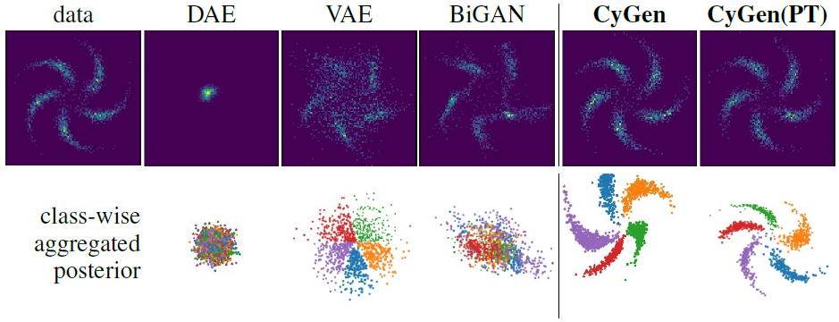
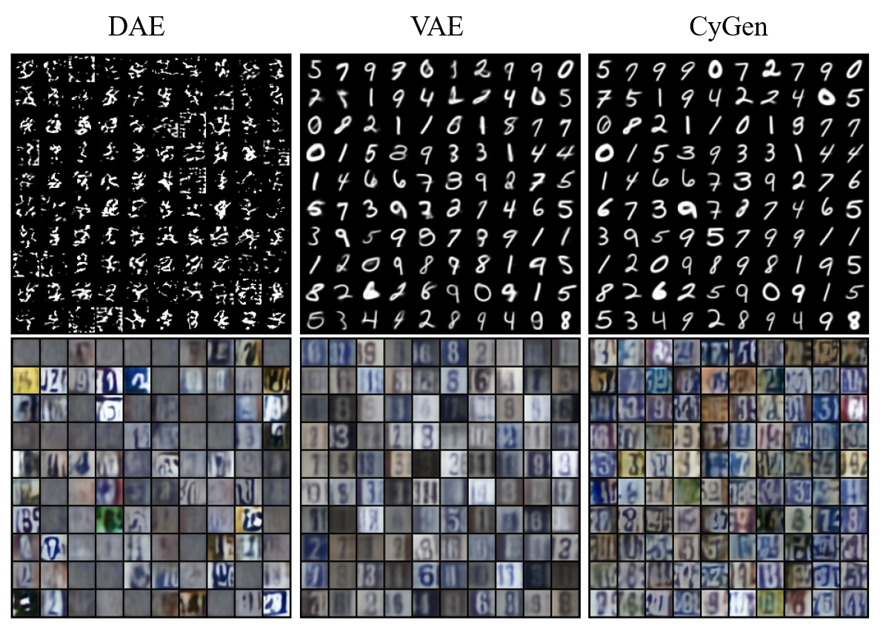

# On the Generative Utility of Cyclic Conditionals

This repository is the official implementation of "[On the Generative Utility of Cyclic Conditionals](https://arxiv.org/abs/2106.15962)" (NeurIPS 2021).

[Chang Liu][changliu] \<<changliu@microsoft.com>\>,
Haoyue Tang, Tao Qin, Jintao Wang, Tie-Yan Liu.\
\[[Paper & Appendix](https://changliu00.github.io/cygen/cygen.pdf)\]
\[[Slides](https://changliu00.github.io/cygen/cygen-slides.pdf)\]
\[[Video](https://recorder-v3.slideslive.com/?share=52410&s=7530b180-ebd9-4e7b-9f11-37503185c774)\]
\[[Poster](https://changliu00.github.io/cygen/cygen-poster.pdf)\]

## Introduction



Whether and how can two conditional models p(x|z) and q(z|x) that form a cycle uniquely determine a joint distribution p(x,z)?
We develop a general theory for this question, including criteria for the two conditionals to correspond to a common joint (**compatibility**) and for such joint to be unique (**determinacy**).
As in generative models we need a generator (decoder/likelihood model) and also an encoder (inference model) for representation,
the theory indicates they could already define a generative model p(x,z) **without** specifying a prior distribution p(z)!
We call this novel generative modeling framework as **CyGen**, and develop methods to achieve
the eligibility (compatibility and determinacy) and the usage (fitting and generating data) as a generative model.

This codebase implements these CyGen methods, and various baseline methods.
The model architectures are based on the [Sylvester flow](https://github.com/riannevdberg/sylvester-flows) (Householder version),
and the experiment environments/setups follow [FFJORD](https://github.com/rtqichen/ffjord).
Authorship is clarified in each file.

## Requirements

The code requires python version >= 3.6, and is based on [PyTorch](https://github.com/pytorch/pytorch). To install requirements:

```setup
pip install -r requirements.txt
```

## Usage

Run the `run_toy.sh` and `run_image.sh` scripts for the synthetic and real-world (i.e. MNIST and SVHN) experiments.
See the commands in the script files or `python3 main_[toy|image].py --help` for customized usage or hyperparameter tuning.
<!--(Note the CyGen method is called `dualdgm` in the codes.)-->

For the real-world experiments, downstream classification accuracy is evaluated along training.
To evaluate the FID score, run the command `python3 compute_gen_fid.py --load_dict=<path_to_model.pth>`.

## Results



As a trailer, we show the synthetic results here.
We see that CyGen achieves both high-quality data generation, and well-separated latent clusters (useful representation).
This is due to the removal of a specified prior distribution so that the manifold mismatch and posterior collapse problems are avoided.
DAE (denoising auto-encoder) does not need a prior, but its training method hurts determinacy.
If pretrained as a VAE (i.e. CyGen(PT)), we see that the knowledge of a centered and centrosymmetric prior is encoded through the conditional models.
See the paper for more results.

<!---->
<!---->
<!--We show the generation results on the MNIST and SVHN datasets.-->
<!--We compare our methods with VAE and DAE.-->
<!--As illustrated in the figure, CyGen improves generation quality on MNIST dataset compared with the pretrained VAE model.-->
<!--DAE models has less satisfying generation quality due to incompatible conditionals.-->

[changliu]: https://changliu00.github.io/

